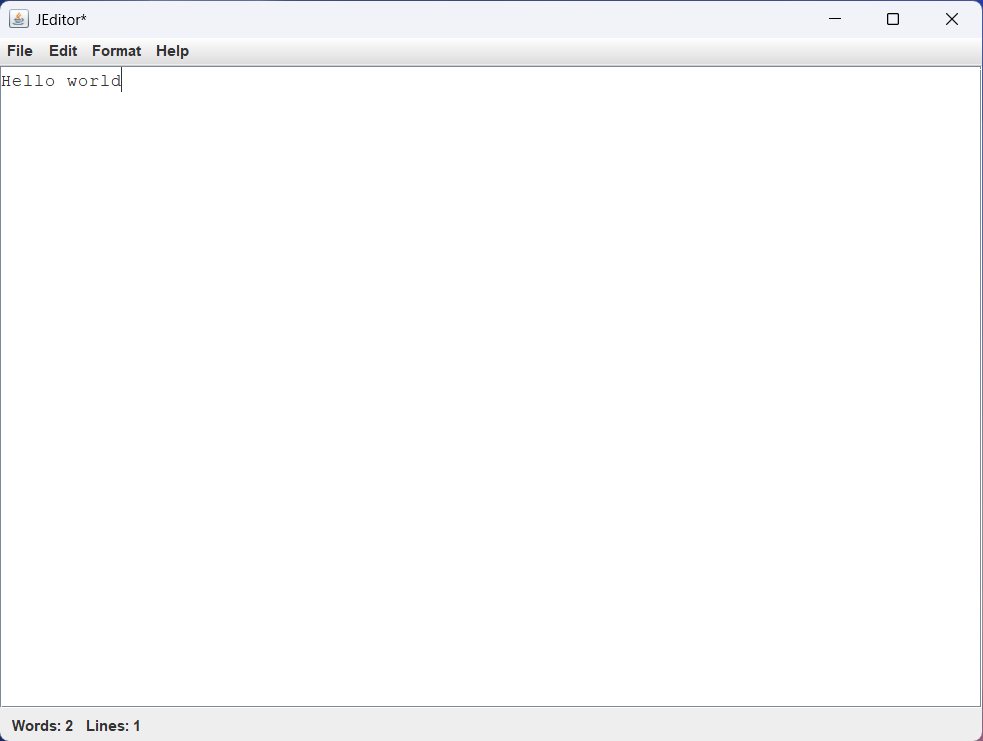
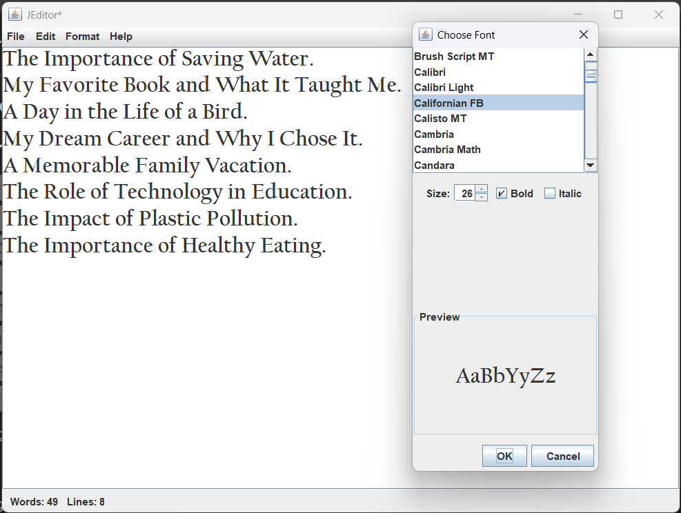
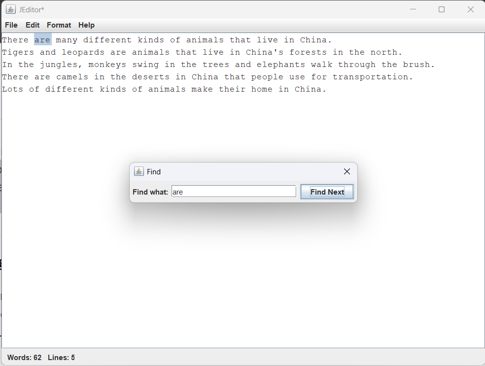

# JEditor - A Lightweight Java Swing Text Editor

JEditor is a simple, lightweight, and cross-platform desktop text editor built from scratch using the Java Swing GUI toolkit. Designed as a comprehensive learning project, it provides all the essential functionality of a classic text editor in a clean and intuitive user interface.

### Main Application


---

## Features

JEditor is a fully-featured text editor that includes:

* **File Operations:** Full support for creating new files, opening existing files from the local system, saving, and "Save As" functionality.
* **State Management:** The editor intelligently tracks unsaved changes and provides visual feedback (an asterisk `*` in the title bar) to prevent accidental data loss.
* **Standard Edit Functions:** Basic but essential cut, copy, and paste capabilities integrated directly with the system clipboard.
* **Text Search:** A non-modal "Find" dialog to search for text within the document, highlighting each occurrence sequentially.
* **Font Customization:** A rich "Font Chooser" dialog that allows the user to change the font family, style (bold/italic), and size, with a real-time preview.
* **Real-Time Status Bar:** A persistent status bar at the bottom of the window displays a live word count and line count, which updates as the user types.
* **Help Dialog:** A simple "About" box provides version information for the application.

### Feature Showcase

| Font Chooser                                         | Find Dialog in Action                                  |
| ---------------------------------------------------- | ------------------------------------------------------ |
|  |  |


## Technology Stack

* **Language:** Java
* **GUI Framework:** Java Swing, Java AWT (for event handling, graphics, and layout management)
* **Build Tool:** Apache Maven
* **Version Control:** Git & GitHub
* **IDE:** Eclipse IDE for Java Developers

## How to Run

This project is built with Maven, which handles compilation and execution.

#### Prerequisites:
* Java Development Kit (JDK) 8 or higher
* Apache Maven

#### Steps:
1.  **Clone the repository:**
    ```bash
    git clone [https://github.com/rajtharun08/JEditor.git](https://github.com/rajtharun08/JEditor.git)
    ```

2.  **Navigate to the project directory:**
    ```bash
    cd JEditor
    ```

3.  **Compile and run the application:**
    ```bash
    mvn compile exec:java
    ```

## Learning Outcomes

This project was a deep dive into core Java principles and desktop application development. Key skills demonstrated include:
* **Object-Oriented Design:** Structuring the application logically into a main class and separate dialog classes.
* **GUI Development:** Building a complex, multi-component user interface using Java Swing.
* **Event-Driven Programming:** Implementing a responsive user experience with `ActionListener` and `DocumentListener`.
* **Advanced Layout Management:** Using `BorderLayout`, `FlowLayout`, and `GridLayout` to create a clean and organized UI.
* **State Management:** Implementing logic to track application state (current file, unsaved changes).
* **File I/O:** Reading from and writing to the local file system using the modern Java NIO API.
